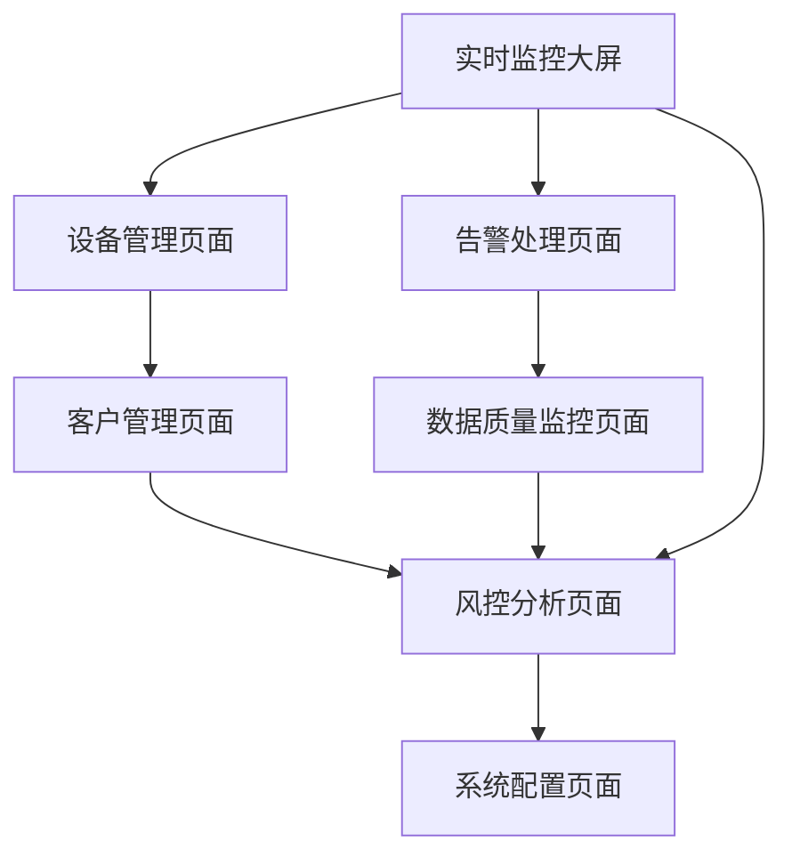

# 国网风控数仓分层架构产品需求文档

## 1. 产品概述

本项目旨在构建基于Fluss的国网电力风控实时数据仓库分层架构，实现电力设备监控、用电客户管理、异常告警处理等核心业务场景的实时数据处理和分析。

通过CDC技术实时采集电力业务数据，经过ODS-DWD-DWS-ADS四层数仓架构处理，为电力运维人员提供实时监控指标、设备健康度评分、用电趋势分析等关键业务洞察。

该系统将为国网电力系统提供秒级数据响应能力，支撑电力安全运行和风险防控决策。

## 2. 核心功能

### 2.1 用户角色

| 角色 | 注册方式 | 核心权限 |
|------|----------|----------|
| 电力运维人员 | 系统内部账号 | 查看实时监控数据、设备状态、告警信息 |
| 数据工程师 | 技术部门分配 | 管理数据流、配置数仓分层、监控数据质量 |
| 风控分析师 | 业务部门申请 | 查看风险指标、分析用电趋势、生成风控报告 |
| 系统管理员 | 超级管理员分配 | 全系统权限、用户管理、系统配置 |

### 2.2 功能模块

本系统包含以下核心页面：

1. **实时监控大屏**：设备运行状态展示、实时告警信息、关键指标监控
2. **设备管理页面**：设备信息维护、设备状态查询、设备健康度分析
3. **客户管理页面**：用电客户信息、用电行为分析、异常用电检测
4. **告警处理页面**：告警事件管理、告警处理流程、告警统计分析
5. **数据质量监控页面**：数据流监控、数据质量检查、ETL任务状态
6. **风控分析页面**：风险指标计算、趋势分析、预警模型
7. **系统配置页面**：参数配置、用户权限、系统维护

### 2.3 页面详情

| 页面名称 | 模块名称 | 功能描述 |
|----------|----------|----------|
| 实时监控大屏 | 设备状态监控 | 展示所有电力设备实时运行状态，包括变压器、开关、线路等设备的电压、电流、功率等关键参数 |
| 实时监控大屏 | 告警信息展示 | 实时显示系统告警信息，按严重程度分级展示，支持告警确认和处理 |
| 实时监控大屏 | 关键指标看板 | 展示总用电量、设备健康度、告警数量等核心KPI指标 |
| 设备管理页面 | 设备信息维护 | 管理设备基础信息，包括设备编号、类型、位置、技术参数等 |
| 设备管理页面 | 设备状态查询 | 查询设备历史运行数据，支持时间范围筛选和多维度分析 |
| 设备管理页面 | 健康度评分 | 基于设备运行数据计算设备健康度评分，预测设备故障风险 |
| 客户管理页面 | 客户信息管理 | 维护用电客户基础信息，包括客户编号、类型、用电容量等 |
| 客户管理页面 | 用电行为分析 | 分析客户用电模式，识别异常用电行为，支持用电预测 |
| 客户管理页面 | 异常检测 | 基于用电数据检测异常用电行为，生成风险预警 |
| 告警处理页面 | 告警事件管理 | 管理系统产生的各类告警事件，支持告警分类、优先级设置 |
| 告警处理页面 | 处理流程跟踪 | 跟踪告警处理流程，记录处理人员、处理时间、处理结果 |
| 告警处理页面 | 统计分析 | 统计告警频次、处理效率，分析告警趋势和模式 |
| 数据质量监控页面 | 数据流监控 | 监控CDC数据流状态，检查数据延迟、丢失等问题 |
| 数据质量监控页面 | 质量检查 | 检查数据完整性、准确性、一致性，生成数据质量报告 |
| 数据质量监控页面 | ETL任务监控 | 监控数仓ETL任务执行状态，包括ODS、DWD、DWS、ADS各层处理情况 |
| 风控分析页面 | 风险指标计算 | 计算设备风险指标、用电风险指标，生成综合风险评分 |
| 风控分析页面 | 趋势分析 | 分析用电趋势、设备性能趋势，预测未来风险变化 |
| 风控分析页面 | 预警模型 | 基于机器学习算法构建预警模型，提前识别潜在风险 |
| 系统配置页面 | 参数配置 | 配置系统运行参数、告警阈值、数据处理规则 |
| 系统配置页面 | 用户权限管理 | 管理用户账号、角色权限、访问控制 |
| 系统配置页面 | 系统维护 | 系统备份、日志管理、性能优化 |

## 3. 核心流程

### 3.1 数据处理流程

**实时数据处理流程：**
1. PostgreSQL Source数据库接收电力业务系统数据
2. CDC组件实时捕获数据变更
3. 数据进入Fluss ODS层进行原始数据存储
4. DWD层对数据进行清洗、标准化和维度关联
5. DWS层按业务主题进行数据汇总和预聚合
6. ADS层生成面向应用的指标数据
7. 最终结果写入PostgreSQL Sink数据库
8. 前端应用实时展示处理结果

**告警处理流程：**
1. 系统检测到异常数据或设备状态
2. 触发告警规则生成告警事件
3. 告警信息推送到运维人员
4. 运维人员确认并处理告警
5. 记录处理过程和结果
6. 更新设备状态和风险评级

## 4. 用户界面设计

### 4.1 设计风格

- **主色调**：深蓝色(#1890FF)作为主色，象征电力行业的专业性和稳定性
- **辅助色**：橙色(#FA8C16)用于告警和重要提示，绿色(#52C41A)用于正常状态
- **按钮样式**：圆角矩形按钮，支持悬停和点击效果
- **字体**：主要使用14px微软雅黑，标题使用16-20px加粗
- **布局风格**：响应式卡片布局，支持大屏展示和移动端适配
- **图标风格**：使用Ant Design图标库，保持一致的视觉风格

### 4.2 页面设计概览

| 页面名称 | 模块名称 | UI元素 |
|----------|----------|--------|
| 实时监控大屏 | 设备状态监控 | 大屏展示布局，实时数据图表，状态指示灯，颜色编码(绿色正常/黄色警告/红色故障) |
| 实时监控大屏 | 告警信息展示 | 滚动告警列表，告警级别标识，时间轴展示，一键确认按钮 |
| 实时监控大屏 | 关键指标看板 | 数字大屏显示，环形进度条，趋势图表，对比分析 |
| 设备管理页面 | 设备信息维护 | 表格列表，搜索筛选，编辑表单，批量操作按钮 |
| 设备管理页面 | 设备状态查询 | 时间选择器，多维度筛选，数据图表，导出功能 |
| 设备管理页面 | 健康度评分 | 评分仪表盘，健康度趋势图，风险等级标识，预测曲线 |
| 客户管理页面 | 客户信息管理 | 客户列表，详情弹窗，信息编辑表单，关联设备展示 |
| 客户管理页面 | 用电行为分析 | 用电曲线图，行为模式分析，异常标记，预测模型 |
| 告警处理页面 | 告警事件管理 | 告警列表，状态筛选，处理按钮，详情查看 |
| 告警处理页面 | 处理流程跟踪 | 流程时间轴，处理记录，状态更新，责任人分配 |
| 数据质量监控页面 | 数据流监控 | 实时监控图表，数据流向图，延迟统计，异常告警 |
| 数据质量监控页面 | ETL任务监控 | 任务状态列表，执行日志，性能指标，重试机制 |
| 风控分析页面 | 风险指标计算 | 风险评分卡，指标权重配置，计算规则设置，结果展示 |
| 风控分析页面 | 趋势分析 | 趋势图表，预测模型，对比分析，报告生成 |
| 系统配置页面 | 参数配置 | 配置表单，参数分类，实时生效，配置历史 |

### 4.3 响应式设计

系统采用桌面优先的响应式设计，支持1920x1080大屏展示，同时兼容平板和移动设备访问。大屏模式下优化数据可视化效果，移动端重点保证核心功能的易用性。